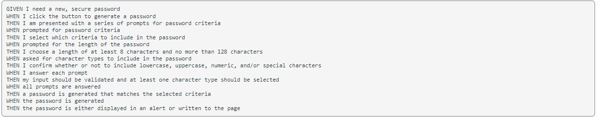
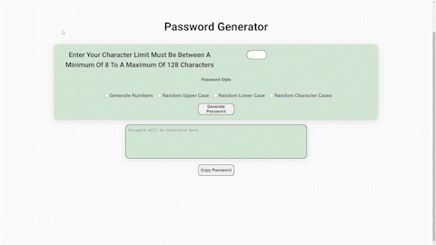

# <Mod Three Challenge>

## Description

For this project we are tasked in creating a random password generator using Javascript

Here is the following requirements for the page

## What Was Asked

Although the challenge wanted us to execute the pass through functions of the required challenge was through choices through alerts.

## My Version

I decided to go in a much more user friendly approach. Instead of alerts I go through a checkbox approach to them as seen here:

Here you enter character limits within a select parameter and select your options. There the options are read and generated.

## Issues With This Project

* I tend to over think the logic of this I tried using an addEventListener function for each checkbox to return a certain value to add to an array. This was rather difficult as I did not know how to properly apply a checkbox with no value. 

* The combination is limited so far and more will be added.

*Second project that had to be rehomed due to git issues with merging. Here is the original repo https://github.com/mambrocio/chal-three-generator
That is where the original history of the commits are located.

## Note

I added a copy of the old javascript functions of how it played it if you want to take a look a round the repository.

## Link To Github Page

https://mambrocio.github.io/pw-gen/
